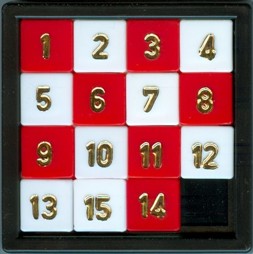

# Sliding-Puzzle
## Play
[게임 플레이](https://c2lv.github.io/Sliding-Puzzle/)
## Introduce
나무위키의 [이미지](https://ww.namu.la/s/7ba5534c5f457da45fc981e298254a28a5168a8dd428c1cb6c8fa85c1cf50b82e6f66d0707bb5e0e7bd96b9f4983fa67786366a311b475b737fc11e23ab83cef2a68c26fe182cf66550d780ac3076ca819bf76376c44d10dca60d5a5d2a9e3e8f793cc7e9acaab90256c773e485b1d13)와 [상세 글](https://namu.wiki/w/%EC%8A%AC%EB%9D%BC%EC%9D%B4%EB%94%A9%20%ED%8D%BC%EC%A6%90)을 인용합니다.
> 슬라이딩 퍼즐은 조각판을 움직여서 순서대로 맞추는 퍼즐 놀이다. 일반적으로 직사각형 구조로 배열된 숫자 조각판들로 구성되어 있고 직사각형 틀 안에 조각판을 옮길 수 있는 빈 칸 하나가 존재한다. 단 하나의 빈 칸을 제외하면 조각판들끼리 서로의 움직임을 제한하기 때문에 모든 조각판을 순서대로 나열하기 위해서는 사고력이 필요하다. 조각판을 들어올리거나 틀을 분해하여 퍼즐을 해결하는 것은 금지되어 있다.

- 한 번에 한 칸씩만 움직일 수 있으며, 빈 칸에 인접한 칸만 빈 칸으로 움직일 수 있습니다.  
- 해당 게임은 4 x 4 크기의 퍼즐입니다. 이동 가능한 칸을 클릭하면 그 칸과 빈 칸의 자리를 바꿉니다.  
- 아래 이미지에서 14와 15를 바꾼 상태가 완성된 모습입니다. (참고로 하단 상태에서는 퍼즐을 완성할 수 없습니다.)  

- 페이지를 시작 또는 새로고침 하거나 퍼즐을 완성한 후에는 최대 1000번 퍼즐을 랜덤하게 섞습니다. 완전히 완성된 퍼즐이 나오지는 않지만, 운이 좋다면 거의 완성된 상태의 퍼즐을 풀게 될 지도 모릅니다.  
## Problem
- 퍼즐을 맞추기 위해서 최소 N번 이상 움직여야 하는 상태로 퍼즐을 초기화할 수 있다면 좋겠습니다.
- 첨부한 이미지나 제공된 이미지에 따라 이미지를 퍼즐처럼 나눠서 풀 수 있다면 좋겠습니다.